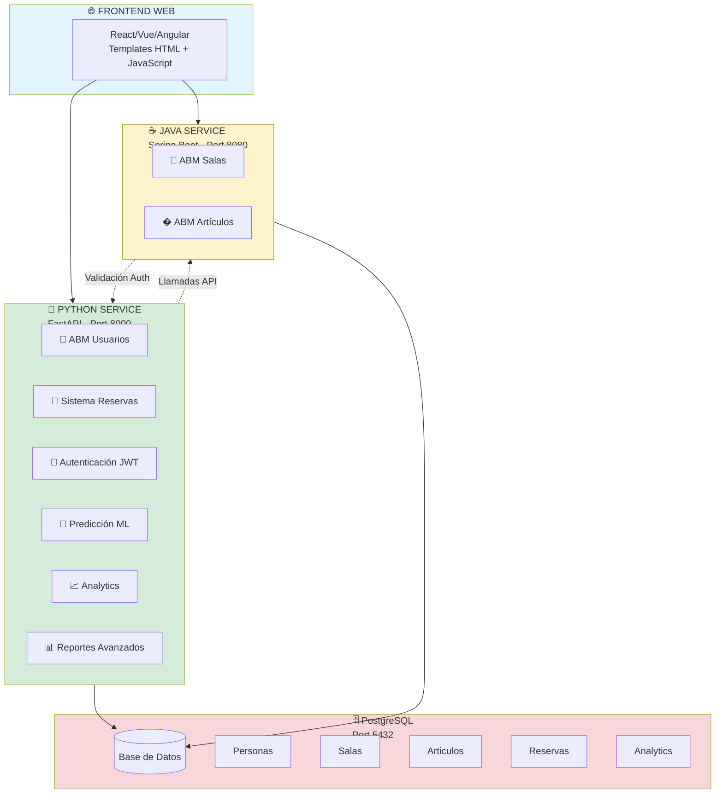

# 🏢 Sistema de Reservas - Arquitectura Microservicios

## 📚 Información Académica

- **Asignatura:** Programación de Vanguardia  
- **Carrera:** Licenciatura en Tecnologías Informáticas
- **Ciclo Lectivo:** 2025

## 📖 Descripción

Sistema moderno de gestión de reservas implementado con **arquitectura de microservicios**, combinando **Python (FastAPI)** para operaciones CRUD y autenticación, con **Java (Spring Boot)** para lógica avanzada, reportes y predicción ML.

## 🏗️ Arquitectura del Sistema



## 📋 Distribución de Responsabilidades

### 🐍 Python Service (Port 8000)
| Módulo | Funcionalidad | Estado |
|--------|---------------|--------|
| 👤 **ABM Usuarios** | Gestión completa de personas + Auth JWT | ✅ Implementado |
| 📅 **Sistema Reservas** | Creación y gestión de reservas | ✅ Implementado |
| 🔐 **Autenticación** | Login, JWT, roles (admin/usuario) | ✅ Implementado |
| 🎨 **Frontend Web** | Templates HTML + JavaScript | ✅ Implementado |
| 🤖 **Predicción ML** | Análisis y predicción de demanda con scikit-learn | ⏳ Pendiente |
| � **Analytics** | Métricas, estadísticas y patrones de uso | ⏳ Pendiente |
| 📊 **Reportes Avanzados** | Generación de informes complejos (PDF/Excel) | ⏳ Pendiente |

### ☕ Java Service (Port 8080)
| Módulo | Funcionalidad | Estado |
|--------|---------------|--------|
| 🏢 **ABM Salas** | CRUD de espacios reservables | ⏳ Pendiente |
| � **ABM Artículos** | CRUD de recursos/inventario | ⏳ Pendiente |

### ️ Tecnologías Utilizadas

#### Python Stack
- **Backend:** FastAPI
- **ORM:** SQLAlchemy 2.0 con Mapped types
- **Validación:** Pydantic v2
- **Auth:** JWT (JSON Web Tokens)
- **Templates:** Jinja2
- **Data Science:** pandas, numpy, scikit-learn
- **Visualización:** matplotlib, plotly
- **Reportes:** reportlab (PDF), openpyxl (Excel)

#### Java Stack (Propuesto)
- **Backend:** Spring Boot 3.x
- **ORM:** Spring Data JPA
- **Build:** Maven
- **Testing:** JUnit 5
- **Lombok:** Reducción de boilerplate

#### Infraestructura
- **Base de Datos:** PostgreSQL 15
- **Containerización:** Docker & Docker Compose
- **Testing:** Postman Collections

## ⚡ Funcionalidades

### ✅ Implementadas en Python Service

#### 👥 Gestión de Personas (Usuarios)
- ✅ CRUD completo de usuarios
- ✅ Autenticación con JWT
- ✅ Roles: Admin y Usuario
- ✅ Validación de emails únicos
- ✅ Login con cookies HTTP-only
- ✅ Control de acceso por roles

#### 🏛️ Administración de Salas  
- ✅ CRUD completo de salas
- ✅ Gestión de capacidades
- ✅ Control de disponibilidad
- ✅ Información de ubicación
- ⏳ Migración a Java Service (pendiente)

#### 📅 Sistema de Reservas
- ✅ Creación de reservas (salas y/o artículos)
- ✅ Validación de conflictos
- ✅ Consulta de disponibilidad
- ✅ Frontend web completo

### ⏳ Pendientes en Python Service

#### 🤖 Predicción ML
- ⏳ Análisis de patrones con scikit-learn
- ⏳ Predicción de demanda futura
- ⏳ Optimización de recursos
- ⏳ Identificación de horarios pico
- ⏳ Modelos de clasificación y regresión

#### 📈 Analytics
- ⏳ Dashboard de métricas en tiempo real
- ⏳ Tendencias de uso con pandas
- ⏳ Heatmap de reservas
- ⏳ KPIs del sistema
- ⏳ Análisis de comportamiento de usuarios

#### 📊 Reportes Avanzados
- ⏳ Reportes por período
- ⏳ Recursos más utilizados
- ⏳ Tasa de ocupación
- ⏳ Exportación a PDF (reportlab)
- ⏳ Exportación a Excel (openpyxl)
- ⏳ Gráficos y visualizaciones

### ⏳ Pendientes en Java Service

#### 🏢 ABM de Salas (Migración desde Python)
- ⏳ CRUD completo de salas
- ⏳ Control de disponibilidad
- ⏳ Validación de capacidades
- ⏳ Integración con reservas

#### � ABM de Artículos
- ⏳ CRUD completo de artículos
- ⏳ Control de disponibilidad
- ⏳ Categorización por tipo
- ⏳ Historial de uso
- ⏳ Gestión de inventario

## 🗃️ Modelo de Datos

El sistema maneja cuatro entidades principales:

- **👥 Personas** - Usuarios del sistema con nombre y email único
- **🏛️ Salas** - Espacios físicos con capacidad definida  
- **📦 Artículos** - Equipamiento reservable con estado de disponibilidad
- **📅 Reservas** - Vinculación de personas con salas/artículos en fechas específicas

### Relaciones
- Una **reserva** pertenece a una **persona** (obligatorio)
- Una **reserva** puede ser de una **sala** O un **artículo** (exclusivo)
- Las **reservas** incluyen fecha/hora de inicio y fin

## � Instalación y Uso

### Requisitos Previos
- Python 3.11+
- Docker y Docker Compose
- Git

### Instalación Rápida
```bash
# 1. Clonar repositorio
git clone <repo-url>
cd TP_Prog_Vanguardia

# 2. Ejecutar setup interactivo
./setup.sh
# El script te preguntará si usar valores por defecto o configurar credenciales personalizadas

# 3. Acceder a la aplicación
# API: http://localhost:8000
# Docs: http://localhost:8000/docs
# PgAdmin: http://localhost:8080
```

### 🔐 Opciones de Configuración

El script `setup.sh` te ofrece dos opciones:

**Opción 1: Configuración por defecto (recomendada)**
- Usa valores seguros predefinidos para desarrollo
- No requiere edición manual
- Perfecto para comenzar rápidamente

**Opción 2: Credenciales personalizadas**
- Te permite editar `.env` y `docker/.env` 
- Para usuarios que quieren credenciales específicas
- El script espera a que termines de editarlos

> 💡 **Al final del setup:** Se muestran las credenciales que están siendo utilizadas

### Configuración Manual
```bash
# Base de datos con Docker
cd docker && docker-compose up -d

# Entorno Python
python -m venv venv
source venv/bin/activate  # Linux/Mac
pip install -r requirements.txt

# Ejecutar aplicación
python main.py
```

## 🔄 Comunicación entre Servicios

### Java → Python
El servicio Java puede llamar a Python para:
- **Validar tokens de autenticación**
- **Consultar información de usuarios**
- **Obtener analytics y predicciones ML**
- **Generar reportes avanzados**

```java
@Service
public class PythonServiceClient {
    private final RestTemplate restTemplate;
    
    public boolean validateUser(String token) {
        String url = "http://localhost:8000/api/v1/personas/me";
        // Validación de autenticación
        // ...
    }
    
    public PredictionDTO getDemandPrediction(Long resourceId) {
        String url = "http://localhost:8000/api/v1/prediction/demand/" + resourceId;
        return restTemplate.getForObject(url, PredictionDTO.class);
    }
}
```

### Python → Java
El servicio Python puede llamar a Java para:
- **Gestionar salas** (después de la migración)
- **Gestionar artículos**

```python
import httpx

async def get_available_salas():
    """Consultar salas disponibles desde Java service"""
    async with httpx.AsyncClient() as client:
        response = await client.get("http://localhost:8080/api/salas/disponibles")
        return response.json()

async def get_articulo(articulo_id: int):
    """Obtener información de un artículo desde Java service"""
    async with httpx.AsyncClient() as client:
        response = await client.get(f"http://localhost:8080/api/articulos/{articulo_id}")
        return response.json()
```

## 📡 APIs Disponibles

### Python Service (Port 8000)

#### Autenticación
- `POST /api/v1/personas/login` - Login con JWT
- `POST /api/v1/personas/web-login` - Login web con cookies
- `GET /api/v1/personas/me` - Usuario actual

#### Personas
- `GET /api/v1/personas` - Listar usuarios
- `POST /api/v1/personas` - Crear usuario
- `GET /api/v1/personas/{id}` - Obtener usuario
- `PUT /api/v1/personas/{id}` - Actualizar
- `DELETE /api/v1/personas/{id}` - Eliminar

#### Salas
- `GET /api/v1/salas` - Listar salas
- `POST /api/v1/salas` - Crear sala
- `GET /api/v1/salas/{id}` - Obtener sala
- `PUT /api/v1/salas/{id}` - Actualizar
- `DELETE /api/v1/salas/{id}` - Eliminar

#### Reservas
- `GET /api/v1/reservas` - Listar reservas
- `POST /api/v1/reservas` - Crear reserva
- `GET /api/v1/reservas/{id}` - Obtener reserva
- `PUT /api/v1/reservas/{id}` - Actualizar
- `DELETE /api/v1/reservas/{id}` - Eliminar

### Java Service (Port 8080) - Propuesto

#### Artículos
- `GET /api/articulos` - Listar artículos
- `POST /api/articulos` - Crear artículo
- `GET /api/articulos/{id}` - Obtener artículo
- `GET /api/articulos/disponibles` - Disponibles

#### Reportes
- `GET /api/reportes/reservas-por-periodo`
- `GET /api/reportes/recursos-mas-usados`
- `GET /api/reportes/utilizacion-salas`

#### Predicción
- `GET /api/prediction/demand/{resourceId}`
- `GET /api/prediction/peak-hours`
- `GET /api/prediction/optimal-allocation`

#### Analytics
- `GET /api/analytics/usage-patterns`
- `GET /api/analytics/trends`
- `GET /api/analytics/dashboard`

## 🧪 Testing

### Postman Collections
El directorio `postman/` contiene colecciones completas para testing:
- Testing de todos los endpoints
- Casos de uso avanzados  
- Validación de errores

### Verificación de Calidad
```bash
# Script de verificación automática
./scripts/check_code_quality.sh
```

## 📚 Documentación

- **`docs/architecture.md`** - Arquitectura completa de microservicios
- **`docs/security.md`** - Configuración de seguridad
- **`docs/formato_codigo.md`** - Estándares de código
- **API Docs Python** - http://localhost:8000/docs (Swagger UI)
- **API Docs Java** - http://localhost:8080/swagger-ui.html (cuando esté implementado)

## 🔒 Seguridad

- ✅ Variables de entorno para credenciales
- ✅ Sin hardcoding de passwords
- ✅ JWT con cookies HTTP-only
- ✅ Control de acceso basado en roles
- ✅ Validación de entrada con Pydantic
- ✅ CORS configurado correctamente

## 🗺️ Roadmap del Proyecto

### ✅ Fase 1: Python Service - Base COMPLETADA
- [x] Configuración de FastAPI
- [x] Modelos SQLAlchemy 2.0
- [x] ABM de Usuarios (Personas)
- [x] ABM de Salas (temporalmente, se migrará a Java)
- [x] Sistema de Reservas
- [x] Autenticación JWT + Cookies
- [x] Frontend Web con templates
- [x] Control de roles (admin/usuario)

### 🔄 Fase 2: Java Service - EN PROGRESO
- [ ] Setup de Spring Boot
- [ ] Configuración de PostgreSQL
- [ ] Migrar ABM de Salas desde Python
- [ ] Implementar ABM de Artículos
- [ ] APIs REST para salas y artículos
- [ ] Validación de tokens con Python service

### ⏳ Fase 3: Analytics y ML en Python - PENDIENTE
- [ ] Módulo de Analytics con pandas
- [ ] Dashboard de métricas en tiempo real
- [ ] Análisis de patrones históricos
- [ ] Modelos de predicción (scikit-learn)
- [ ] Algoritmos de optimización de recursos
- [ ] Identificación de horarios pico

### ⏳ Fase 4: Reportes Avanzados en Python - PENDIENTE
- [ ] Sistema de reportes avanzados
- [ ] Generación de PDF (reportlab)
- [ ] Exportación a Excel (openpyxl)
- [ ] Gráficos y visualizaciones
- [ ] Reportes programados

### ⏳ Fase 5: Integración y Despliegue - PENDIENTE
- [ ] Comunicación Python ↔ Java
- [ ] Docker Compose multi-servicio
- [ ] Testing de integración
- [ ] Documentación completa de APIs
- [ ] CI/CD Pipeline
- [ ] Deployment en producción

## 🚀 Próximos Pasos

1. **Crear proyecto Spring Boot** para el servicio Java
2. **Implementar ABM de Salas** en Java (migración)
3. **Implementar ABM de Artículos** en Java
4. **Configurar comunicación** entre servicios (RestTemplate/httpx)
5. **Implementar módulos ML/Analytics** en Python
4. **Desarrollar módulo de reportes** avanzados
5. **Implementar predicción ML** con algoritmos básicos

## 🤝 Equipo de Desarrollo

Proyecto desarrollado como parte del trabajo práctico de **Programación de Vanguardia**

- **Institución:** Universidad De la Ciudad
- **Carrera:** Licenciatura en Tecnologías Informáticas
- **Ciclo Lectivo:** 2025

## 📄 Licencia

Este proyecto es de uso académico para la asignatura Programación de Vanguardia.

---

📧 **Contacto:** Para consultas sobre el proyecto, contactar al equipo de desarrollo.