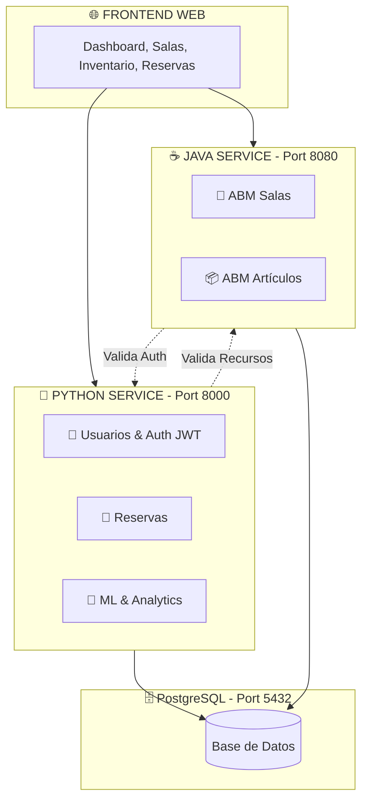

# 🏢 Sistema de Reservas - Arquitectura Microservicios

> Sistema moderno de gestión de reservas con arquitectura de microservicios, combinando **Python (FastAPI)** y **Java (Spring Boot)**.

## 📚 Información Académica

- **Asignatura:** Programación de Vanguardia
- **Carrera:** Licenciatura en Tecnologías Informáticas
- **Ciclo Lectivo:** 2025

---

## 🚀 Inicio Rápido

### Requisitos Previos
- Python 3.11+
- Docker y Docker Compose
- Git

### Instalación

```bash
# 1. Clonar el repositorio
git clone <repo-url>
cd TP_Prog_Vanguardia

# 2. Ejecutar setup automático
./setup.sh

# 3. Acceder a la aplicación
# Frontend: http://localhost:8000
# API Docs Python: http://localhost:8000/docs
# API Docs Java: http://localhost:8080/swagger-ui.html
```

> 💡 **Más detalles:** Consulta la [Guía de Configuración](./docs/configuracion_entorno.md) y [Docker Guide](./docs/docker_guide.md)

---

## 📊 Estado del Proyecto

**Última actualización:** Noviembre 2025  
**Progreso:** 🟢 **~80% Completado**

| Componente | Estado | Descripción |
|------------|--------|-------------|
| 🐍 **Python Service** | ✅ Completo | FastAPI con Auth, Reservas, Predicciones, Analytics |
| ☕ **Java Service** | ✅ Completo | Spring Boot con ABM Salas + Artículos/Inventario |
| 🔗 **Integración HTTP** | ✅ Activa | Comunicación bidireccional Python ↔ Java |
| 🗄️ **PostgreSQL** | ✅ Funcional | Base de datos compartida (5 tablas) |
| 🎨 **Frontend Web** | ✅ Completo | Templates HTML + JavaScript |
| 🤖 **ML/Analytics** | ✅ Completo | Predicciones con análisis de patrones + Dashboards |
| 🐳 **Docker** | ✅ Funcional | Containerización lista |

---

## 🏗️ Arquitectura



> 📖 **Más detalles:** [Documentación de Arquitectura](./docs/architecture.md)

---

## 🛠️ Stack Tecnológico

### Python Service
- **Backend:** FastAPI
- **ORM:** SQLAlchemy 2.0
- **Auth:** JWT
- **Analytics:** pandas, numpy (análisis de patrones)

### Java Service
- **Backend:** Spring Boot 3.3.0 + Java 17
- **ORM:** Spring Data JPA
- **Docs:** SpringDoc OpenAPI (Swagger)

### Infraestructura
- **Base de Datos:** PostgreSQL 15
- **Containerización:** Docker & Docker Compose

---

## 📚 Documentación

### 📖 Guías Principales

| Documento | Descripción |
|-----------|-------------|
| [🏗️ Arquitectura](./docs/architecture.md) | Diseño completo del sistema |
| [⚙️ Configuración](./docs/configuracion_entorno.md) | Variables de entorno |
| [🐳 Docker](./docker/README.md) | Guía de contenedores |
| [☕ Java Service](./java-service/README.md) | API Java Spring Boot |
| [📋 API Reference](./docs/api_reference.md) | Referencia de endpoints |
| [❓ FAQ](./docs/faq.md) | Preguntas frecuentes |
| [🔧 Troubleshooting](./docs/troubleshooting.md) | Solución de problemas |

### 🎯 Por Tipo de Usuario

**Desarrolladores:**
1. [Configuración de Entorno](./docs/configuracion_entorno.md)
2. [Arquitectura del Sistema](./docs/architecture.md)
3. [Estándares de Código](./docs/formato_codigo.md)

**Evaluadores/Profesores:**
1. [Estado del Proyecto](#-estado-del-proyecto) (esta sección)
2. [Guía Docker](./docker/README.md)
3. [Testing con Postman](./postman/README.md)

---

## 📡 APIs Principales

### Python Service (Port 8000)
- **Auth:** `POST /api/v1/personas/login`
- **Usuarios:** `GET|POST|PUT|DELETE /api/v1/personas`
- **Reservas:** `GET|POST|PUT|DELETE /api/v1/reservas`
- **Analytics:** `GET /api/stats/*`
- **Docs:** http://localhost:8000/docs

### Java Service (Port 8080)
- **Salas:** `GET|POST|PUT|DELETE /api/salas`
- **Artículos:** `GET|POST|PUT|DELETE /api/articulos`
- **Docs:** http://localhost:8080/swagger-ui.html

> 📋 **Referencia completa:** [API Reference](./docs/api_reference.md)

---

## 🧪 Testing

### Colecciones Postman
```bash
# Importar colección desde:
postman/Sistema_Completo_API_Collection.postman_collection.json
```

### Scripts de Verificación
```bash
# Verificar integración entre servicios
./scripts/test_integration.sh

# Verificar calidad de código
./scripts/check_code_quality.sh
```

> 📮 **Más información:** [Postman README](./postman/README.md)

---

## 🐳 Docker

### Modo Database-Only (Recomendado)
```bash
cd docker
./start-db-only.sh

# Ejecutar servicios manualmente:
# Terminal 1: Python service
python main.py

# Terminal 2: Java service
cd java-service && ./run.sh
```

### Detener Servicios
```bash
cd docker
./stop-all.sh
```

> 🐳 **Guía completa:** [Docker README](./docker/README.md)

---

## 📂 Estructura del Proyecto

```
TP_Prog_Vanguardia/
├── app/                    # 🐍 Código Python (FastAPI)
├── java-service/           # ☕ Código Java (Spring Boot)
├── docs/                   # 📚 Documentación técnica
├── docker/                 # 🐳 Configuración Docker
├── templates/              # 🎨 Frontend HTML
├── static/                 # 📁 CSS/JS
├── scripts/                # 🛠️ Scripts útiles
├── postman/                # 📮 Colecciones de API
├── tests/                  # 🧪 Tests
└── README.md              # 📄 Este archivo
```

> 🗂️ **Detalles completos:** Ver sección "Estructura del Repositorio" en [Architecture](./docs/architecture.md)

---

## 🧪 Tests

El proyecto incluye **24 tests unitarios** que cubren los componentes principales del microservicio Python.

### Ejecutar Tests

```bash
# Todos los tests
pytest tests/unit/ -v

# Con cobertura
pytest tests/unit/ --cov=app --cov-report=term

# Tests específicos
pytest tests/unit/test_models.py -v
```

### Integración con SonarQube

```bash
# Análisis de calidad con SonarQube local
sonar-scanner -Dsonar.token=$SONAR_TOKEN
```

> 🧪 **Documentación completa:** [Testing Guide](./docs/testing.md)

---

## 🔒 Seguridad

- ✅ Variables de entorno para credenciales
- ✅ JWT con cookies HTTP-only
- ✅ Control de acceso por roles
- ✅ Validación de entrada (Pydantic)
- ✅ CORS configurado

---

## 🤝 Equipo de Desarrollo

**Universidad De la Ciudad**  
Licenciatura en Tecnologías Digitales - 2025

---

## 📄 Licencia

Proyecto académico para la asignatura Programación de Vanguardia.

---

## 🔗 Enlaces Útiles

- [📚 Índice de Documentación](./docs/README.md)
- [🐳 Docker Setup](./docker/README.md)
- [☕ Java Service API](./java-service/README.md)
- [🛠️ Scripts Útiles](./scripts/README.md)
- [📮 Testing Postman](./postman/README.md)

---

**¿Necesitas ayuda?** Consulta el [FAQ](./docs/faq.md) o [Troubleshooting](./docs/troubleshooting.md)
