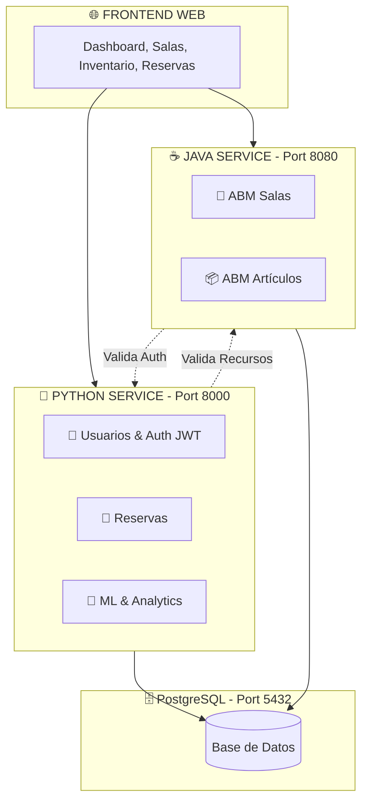

# 🏢 Sistema de Reservas - Arquitectura Microservicios

> Sistema moderno de gestión de reservas con arquitectura de microservicios, combinando **Python (FastAPI)** y **Java (Spring Boot)**.

## 📚 Información Académica

- **Asignatura:** Programación de Vanguardia
- **Carrera:** Licenciatura en Tecnologías Digitales
- **Ciclo Lectivo:** 2025
- **Consigna:** Este proyecto fue desarrollado siguiendo los requerimientos especificados en [`consigna.md`](./consigna.md)

---

## 🚀 Inicio Rápido

### Requisitos Previos
- Python 3.11+
- Docker y Docker Compose
- Git
- Java 17+ (para modo DB-only)
- Maven (para modo DB-only)

### Instalación Automática

**Mac/Linux:**
```bash
# 1. Clonar el repositorio
git clone <repo-url>
cd TP_Prog_Vanguardia

# 2. Ejecutar setup automático
./setup_inicia_todo.sh

# 3. Seleccionar modo de ejecución:
#    [1] DB-only: Base de datos en Docker, servicios locales
#    [2] Full Docker: Todo en contenedores
```

**Windows:**
```cmd
REM 1. Clonar el repositorio
git clone <repo-url>
cd TP_Prog_Vanguardia

REM 2. Ejecutar setup automático
setup_inicia_todo.bat

REM 3. Seleccionar modo de ejecución:
REM    [1] DB-only: Base de datos en Docker, servicios locales
REM    [2] Full Docker: Todo en contenedores
```

### Acceder a la Aplicación

Después del setup, los servicios estarán disponibles en:

- 🌐 **Frontend:** http://localhost:8000
- 📚 **API Docs Python:** http://localhost:8000/docs
- ☕ **API Docs Java:** http://localhost:8080/swagger-ui.html
- 🐘 **PgAdmin:** http://localhost:5050

> 💡 **Guías detalladas:**
> - [📝 Scripts de Setup](./docs/SETUP_SCRIPTS.md) - Explicación completa de modos y scripts
> - [⚙️ Configuración](./docs/configuracion_entorno.md) - Variables de entorno
> - [🐳 Docker Guide](./docs/docker_guide.md) - Gestión de contenedores

---

## 📊 Estado del Proyecto

**Última actualización:** Noviembre 2025  
**Progreso:** 🟢 **~80% Completado**

| Componente | Estado | Descripción |
|------------|--------|-------------|
| 🐍 **Python Service** | ✅ Completo | FastAPI con Auth, Reservas, Predicciones, Analytics |
| ☕ **Java Service** | ✅ Completo | Spring Boot con ABM Salas + Artículos/Inventario |
| 🔗 **Integración HTTP** | ✅ Activa | Comunicación bidireccional Python ↔ Java |
| 🗄️ **PostgreSQL** | ✅ Funcional | Base de datos compartida (5 tablas) |
| 🎨 **Frontend Web** | ✅ Completo | Templates HTML + JavaScript |
| 🤖 **ML/Analytics** | ✅ Completo | Predicciones con análisis de patrones + Dashboards |
| 🐳 **Docker** | ✅ Funcional | Containerización lista |

---

## 🏗️ Arquitectura



> 📖 **Más detalles:** [Documentación de Arquitectura](./docs/architecture.md)

---

## 🛠️ Stack Tecnológico

### Python Service
- **Backend:** FastAPI
- **ORM:** SQLAlchemy 2.0
- **Auth:** JWT
- **Analytics:** pandas, numpy (análisis de patrones)

### Java Service
- **Backend:** Spring Boot 3.3.0 + Java 17
- **ORM:** Spring Data JPA
- **Docs:** SpringDoc OpenAPI (Swagger)

### Infraestructura
- **Base de Datos:** PostgreSQL 15
- **Containerización:** Docker & Docker Compose
- **Timezone:** America/Argentina/Buenos_Aires (configurado automáticamente)

### Sistema de Setup Automatizado
- ✅ **Detección automática** de Docker, Python y Java
- ✅ **Dos modos de ejecución:** DB-only (desarrollo) y Full Docker (producción)
- ✅ **Cache busting automático** con timestamp en cada setup
- ✅ **Creación de admin** por defecto
- ✅ **Scripts multiplataforma:** Mac/Linux (.sh) y Windows (.bat)
- ✅ **Gestión de servicios:** Scripts para iniciar/detener todos los servicios

---

## 📚 Documentación

### 📖 Guías Principales

| Documento | Descripción |
|-----------|-------------|
| [📝 Scripts de Setup](./docs/SETUP_SCRIPTS.md) | **⭐ Guía completa de scripts y modos de ejecución** |
| [🏗️ Arquitectura](./docs/architecture.md) | Diseño completo del sistema |
| [⚙️ Configuración](./docs/configuracion_entorno.md) | Variables de entorno |
| [🐳 Docker](./docker/README.md) | Guía de contenedores |
| [☕ Java Service](./java-service/README.md) | API Java Spring Boot |
| [📋 API Reference](./docs/api_reference.md) | Referencia de endpoints |
| [🔄 Cache Busting](./docs/cache_busting.md) | Sistema de invalidación de caché |
| [❓ FAQ](./docs/faq.md) | Preguntas frecuentes |
| [🔧 Troubleshooting](./docs/troubleshooting.md) | Solución de problemas |

### 🎯 Por Tipo de Usuario

**Desarrolladores - Primera vez:**
1. [📝 Scripts de Setup](./docs/SETUP_SCRIPTS.md) - **⭐ EMPEZAR AQUÍ**
2. [⚙️ Configuración de Entorno](./docs/configuracion_entorno.md)
3. [🏗️ Arquitectura del Sistema](./docs/architecture.md)
4. [📐 Estándares de Código](./docs/formato_codigo.md)

**Evaluadores/Profesores:**
1. [📊 Estado del Proyecto](#-estado-del-proyecto) (esta sección)
2. [📝 Scripts de Setup](./docs/SETUP_SCRIPTS.md) - Instalación rápida
3. [🐳 Guía Docker](./docker/README.md)
4. [📮 Testing con Postman](./postman/README.md)

---

## 📡 APIs Principales

### Python Service (Port 8000)

#### 🔐 Autenticación
- `POST /api/v1/auth/register` - Registrar usuario
- `POST /api/v1/auth/login` - Iniciar sesión (JWT)
- `GET /api/v1/auth/me` - Perfil del usuario autenticado
- `POST /api/v1/auth/logout` - Cerrar sesión

#### 👥 Usuarios (Personas)
- `GET|POST|PUT|DELETE /api/v1/personas` - CRUD completo
- `GET /api/v1/personas/{id}` - Obtener por ID
- `GET /api/v1/personas/email/{email}` - Buscar por email

#### 🏢 Salas
- `GET|POST|PUT|DELETE /api/v1/salas` - CRUD completo
- `GET /api/v1/salas/{id}` - Obtener por ID
- `GET /api/v1/salas/count/total` - Contar total

#### 📦 Artículos
- `GET|POST|PUT|DELETE /api/v1/articulos` - CRUD completo
- `GET /api/v1/articulos/disponibles` - Artículos disponibles
- `GET /api/v1/articulos/estadisticas/inventario` - Estadísticas de inventario
- `PATCH /api/v1/articulos/{id}/toggle-disponibilidad` - Cambiar disponibilidad

#### 📅 Reservas
- `GET|POST|PUT|DELETE /api/v1/reservas` - CRUD completo
- `GET /api/v1/reservas/persona/{id}` - Reservas por persona
- `GET /api/v1/reservas/sala/{id}` - Reservas por sala
- `POST /api/v1/reservas/{id}/articulos/{articulo_id}` - Agregar artículo

#### 📊 Analytics & Predicciones
- `GET /api/v1/analytics/dashboard-metrics` - Métricas del dashboard
- `GET /api/v1/analytics/predictions/weekly-demand` - Demanda semanal (patrones)
- `GET /api/v1/analytics/predictions/peak-hours` - Horarios pico
- `GET /api/v1/analytics/export-report` - Exportar reportes PDF/Excel
- `GET /api/v1/stats/reservas` - Estadísticas de reservas
- `GET /api/v1/stats/uso` - Estadísticas de uso

#### 🔗 Integración Java
- `GET /api/v1/integration/health` - Estado del servicio Java
- `GET /api/v1/integration/salas-desde-java` - Sincronizar salas

**📖 Docs:** http://localhost:8000/docs

---

### Java Service (Port 8080)

#### 🏢 Salas
- `GET|POST|PUT|DELETE /api/salas` - CRUD completo
- `GET /api/salas/{id}` - Obtener por ID
- `GET /api/salas/disponibles` - Salas disponibles
- `GET /api/salas/search?nombre={nombre}` - Buscar por nombre
- `GET /api/salas/capacidad/{min}` - Filtrar por capacidad

#### 📦 Artículos (Inventario)
- `GET|POST|PUT|DELETE /api/articulos` - CRUD completo
- `GET /api/articulos/{id}` - Obtener por ID
- `GET /api/articulos/disponibles` - Artículos disponibles
- `GET /api/articulos/categoria/{categoria}` - Filtrar por categoría
- `GET /api/articulos/search?nombre={nombre}` - Buscar por nombre

**📖 Docs:** http://localhost:8080/swagger-ui.html

---

> 📋 **Referencia completa de 94 endpoints:** [API Reference](./docs/api_reference.md)

---

## 🧪 Testing

### Colecciones Postman
```bash
# Importar colección desde:
postman/Sistema_Completo_API_Collection.postman_collection.json
```

### Scripts de Verificación
```bash
# Verificar integración entre servicios
./scripts/test_integration.sh

# Verificar calidad de código
./scripts/check_code_quality.sh
```

> 📮 **Más información:** [Postman README](./postman/README.md)

---

## 🐳 Docker

### Modos de Ejecución

El proyecto soporta **dos modos de ejecución** configurables durante el setup:

#### 1️⃣ DB-only (Desarrollo)
- ✅ PostgreSQL + PgAdmin en Docker
- ✅ Python y Java ejecutándose localmente
- 🎯 **Ideal para:** Desarrollo activo, debugging, modificaciones frecuentes

#### 2️⃣ Full Docker (Producción/Testing)
- ✅ PostgreSQL + PgAdmin + Python + Java en Docker
- ✅ Ambiente completamente aislado
- 🎯 **Ideal para:** Testing de integración, ambiente de producción

### Gestión de Servicios

**Mac/Linux:**
```bash
# Iniciar todo (con selección de modo)
./setup_inicia_todo.sh

# Solo iniciar servicios locales (modo DB-only)
# Terminal 1: Python
source venv/bin/activate
python main.py

# Terminal 2: Java
cd java-service && ./run.sh

# Detener todos los servicios
./docker/stop-all.sh
```

**Windows:**
```cmd
REM Iniciar todo (con selección de modo)
setup_inicia_todo.bat

REM Solo iniciar servicios locales (modo DB-only)
REM Opción 1: Script automático (recomendado)
start_services.bat

REM Opción 2: Manual en terminales separadas
REM Terminal 1: Python
venv\Scripts\activate
python main.py

REM Terminal 2: Java
cd java-service
mvnw.cmd spring-boot:run

REM Detener todos los servicios
docker\stop-all.bat
```

### Ver Logs (Modo Full Docker)

```bash
# Mac/Linux
docker-compose -f docker/docker-compose.full.yml logs -f

# Windows
docker-compose -f docker\docker-compose.full.yml logs -f
```

> 🐳 **Documentación completa:**
> - [📝 Scripts de Setup](./docs/SETUP_SCRIPTS.md) - Guía de scripts y modos
> - [🐳 Docker Guide](./docker/README.md) - Configuración avanzada de Docker

---

## 📂 Estructura del Proyecto

```
TP_Prog_Vanguardia/
├── app/                    # 🐍 Código Python (FastAPI)
│   ├── api/               # Endpoints REST
│   ├── auth/              # Autenticación JWT
│   ├── models/            # Modelos SQLAlchemy
│   ├── services/          # Lógica de negocio
│   ├── repositories/      # Acceso a datos
│   └── schemas/           # Schemas Pydantic
├── java-service/           # ☕ Código Java (Spring Boot)
│   └── src/main/java/     # Código fuente Java
├── docs/                   # 📚 Documentación técnica
├── docker/                 # 🐳 Configuración Docker
│   ├── docker-compose.db-only.yml   # Solo base de datos
│   ├── docker-compose.full.yml      # Stack completo
│   ├── stop-all.sh        # Detener servicios (Mac/Linux)
│   └── stop-all.bat       # Detener servicios (Windows)
├── templates/              # 🎨 Frontend HTML (Jinja2)
├── static/                 # 📁 CSS/JS con cache busting
├── scripts/                # 🛠️ Scripts útiles
├── postman/                # 📮 Colecciones de API
├── tests/                  # 🧪 Tests unitarios/integración
├── setup_inicia_todo.sh   # 🚀 Setup Mac/Linux
├── setup_inicia_todo.bat  # 🚀 Setup Windows
├── start_services.bat     # ▶️ Iniciar servicios (Windows)
├── docs/SETUP_SCRIPTS.md       # 📝 Documentación de scripts
└── README.md              # 📄 Este archivo
```

> 🗂️ **Detalles completos:** Ver sección "Estructura del Repositorio" en [Architecture](./docs/architecture.md)

---

## 🧪 Tests

El proyecto incluye **24 tests unitarios** que cubren los componentes principales del microservicio Python.

### Ejecutar Tests

```bash
# Todos los tests
pytest tests/unit/ -v

# Con cobertura
pytest tests/unit/ --cov=app --cov-report=term

# Tests específicos
pytest tests/unit/test_models.py -v
```

### Integración con SonarQube

```bash
# Análisis de calidad con SonarQube local
sonar-scanner -Dsonar.token=$SONAR_TOKEN
```

> 🧪 **Documentación completa:** [Testing Guide](./docs/testing.md)

---

## 🔒 Seguridad

- ✅ Variables de entorno para credenciales
- ✅ JWT con cookies HTTP-only
- ✅ Control de acceso por roles
- ✅ Validación de entrada (Pydantic)
- ✅ CORS configurado

---

## 🤝 Equipo de Desarrollo

**Universidad De la Ciudad**  
Licenciatura en Tecnologías Digitales - 2025

---

## 📄 Licencia

Proyecto académico para la asignatura Programación de Vanguardia.

---

## 🔗 Enlaces Útiles

- [📝 **Scripts de Setup**](./docs/SETUP_SCRIPTS.md) - **⭐ Guía de instalación y modos de ejecución**
- [� Índice de Documentación](./docs/README.md)
- [🐳 Docker Setup](./docker/README.md)
- [☕ Java Service API](./java-service/README.md)
- [🛠️ Scripts Útiles](./scripts/README.md)
- [📮 Testing Postman](./postman/README.md)
- [🔄 Cache Busting](./docs/cache_busting.md)

---
